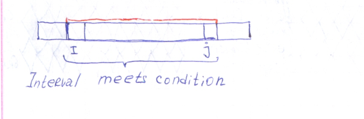
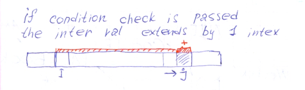
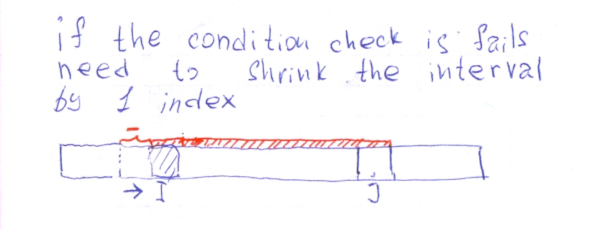
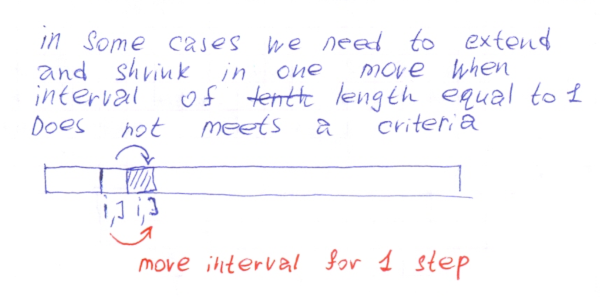

# Sliding window for counting zeros.

In this article I going to explain a basic sliding window concept on the Leetcode problem [Max Consecutive Ones III](https://leetcode.com/problems/max-consecutive-ones-iii/)

### [Leetcode: 1004. Max Consecutive Ones III](https://leetcode.com/problems/max-consecutive-ones-iii/)

Given an array A of 0s and 1s, we may change up to K values from 0 to 1.
Return the length of the longest (contiguous) subarray that contains only 1s. 

Example 1: 
```
Input: A = [1,1,1,0,0,0,1,1,1,1,0], K = 2
Output: 6
Explanation: 
[1,1,1,0,0,1,1,1,1,1,1]
Bolded numbers were flipped from 0 to 1.  The longest subarray is underlined.
```

Example 2:
```
Input: A = [0,0,1,1,0,0,1,1,1,0,1,1,0,0,0,1,1,1,1], K = 3
Output: 10
Explanation: 
[0,0,1,1,1,1,1,1,1,1,1,1,0,0,0,1,1,1,1]
Bolded numbers were flipped from 0 to 1.  The longest subarray is underlined.
```

## Sliding Window is all about the interval.

General Idea in sliding window algorithm is that we support some interval between two pointers that meet certain critera. There are two pointer `i` and `j` and all contigous element between `i` and `j` inclusive answer some criteria. In case of this task the criteria or condtion is number of `0` in the interval. It must be less or equal to `K`. The `K` is the number of `0` we able to substitute by ones.



## Time to extend the interval.

When criteria check is passed. And current interval may be treat as valid one, we able to save information for answer. And it's time to extend the interval by one step for a further iteration.



## Time to shriking the interval untill it meets the criteria again.

When criteris check is failed need to do somehting to restore validness of the interval. Valines of interval tried to be restored by shrinking it by moving left pointer forward and make inteval lenght smaller.




## Some times it needs just move all interval.

Sometimes when the condition for interval is failed inteval has lenght of 1. And there is no way to move left pointer forward bacause it going to step over the right pointer. In this case need to move all interval 1 step worard. Expand and Shring in one step.



## Sliding window solution for the problem.

```Ruby
# 1004. Max Consecutive Ones III
# https://leetcode.com/problems/max-consecutive-ones-iii/
# Runtime: 120 ms, faster than 70.59% of Ruby online submissions for Max Consecutive Ones III.
# Memory Usage: 14.2 MB, less than 100.00% of Ruby online submissions for Max Consecutive Ones III.
# @param {Integer[]} a
# @param {Integer} k
# @return {Integer}
def longest_ones(a, k)
    return 0 if a.empty?
    i,j = 0,0
    number_of_zeros = 0
    number_of_zeros = 1 if a[0].zero?
    answer = 0
    while i < a.size && j < a.size
        if number_of_zeros <= k
            len = j-i + 1
            answer = len if len > answer
            j += 1
            number_of_zeros += 1 if j < a.size && a[j].zero?
        elsif i == j # interval length is 1, and k == 0
            j += 1
            number_of_zeros += 1 if j < a.size && a[j].zero?
            number_of_zeros -= 1 if a[i].zero?
            i += 1
        else
            number_of_zeros -=1 if a[i].zero?
            i += 1
        end
    end
    answer
end
```