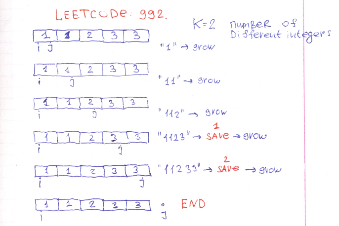
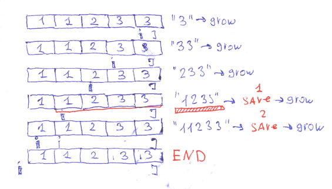
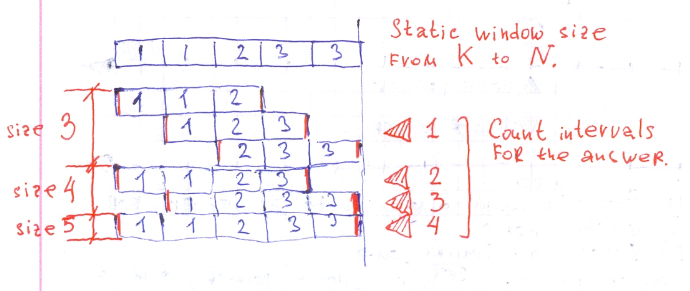

# Traveling of hard sliding window.

It's very useful for a developer to find some problems to solve where typical approaches have not they power, and need to investigate something tricky. Difficult but makes you grow. Today I would tell a story about non typical usage of sliding window. Or more precisely how I solved [Leetcode: 992. Subarrays with K Different Integers.](https://leetcode.com/problems/subarrays-with-k-different-integers/).


## Trying base approach.

What is sliding window? It's just two pointers that moves one after other. When interval between these pointer satisfies some condition the moving right pointer make the interval grows, when conditions is failed interval shrinked by moving left pointer. And the usually a task it to keep track of interval condition. This way easily to check minimal interval and maximum one. But no all intervals. Let's try to make such program that extend interval when there are less or equal different integers then `K`.  `K` will be 3, and interval will be `11233`.



This program will touch next intervals that have 3 different digits: `1123` and `11233`.  It will mark minimum and maximum length of such kind interval but not all possible.

## Next try.

May be it going works if we run window in opposite direction? May be it will covers all possible intervals? Ok lets try. Start window from right side of array, and when condition is satisfied grow the left pointer to the left.  



Nice, new interval been touched `1233`. But it's not enough. There is still `123` unmarked.

## Brute force is something. 

Need to make program work. Do something. And the `O(N**2)` solution is to run several sliding windows with all possible values for a `K`. Because there could not be less then `K` elements in window with `K` different values. Possible solutions is to start `N-K+1` sliding windows of static size from `K` to `N` inclusive.



This code works. But took to many resources.

```Ruby
# 992. Subarrays with K Different Integers
# https://leetcode.com/problems/subarrays-with-k-different-integers/
# @param {Integer[]} a
# @param {Integer} k
# @return {Integer}
def subarrays_with_k_distinct(a, k)
    answer = 0
    (k..a.size).each do |win|
        count = 0
        h = {}
        # first position
        (0...win).each do |i|
            v = a[i]
            h[v] ||= 0
            h[v] += 1
            count += 1 if 1 == h[v]
        end
        answer += 1 if count == k
        # next postions
        (win...a.size).each do |i|
            pass = a[i-win]
            h[pass] -= 1
            count -=1 if 0 == h[pass]
            v = a[i]
            h[v] ||= 0
            h[v] += 1
            count +=1 if 1 == h[v]
            answer += 1 if count == k
        end
    end
    answer
end
```